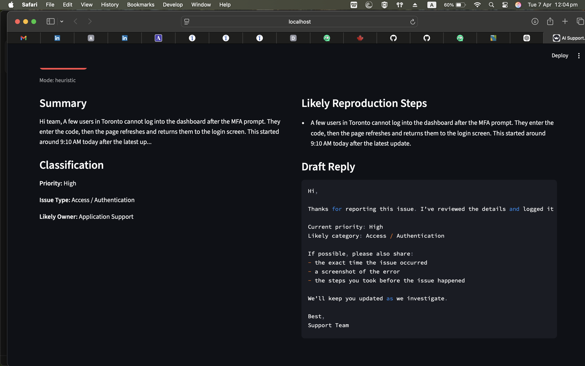

# AI Support Ticket Assistant

A small Streamlit app for support workflows:
- summarize a messy support ticket
- extract priority, issue type, reproduction steps, and likely owner
- draft a professional reply

## Why it is useful
This is great for showing:
- prompt engineering
- structured outputs
- customer support / operations use cases

## Run locally

```bash
python -m venv .venv
source .venv/bin/activate
pip install -r requirements.txt
cp .env.example .env
streamlit run app.py
```

## Demo


